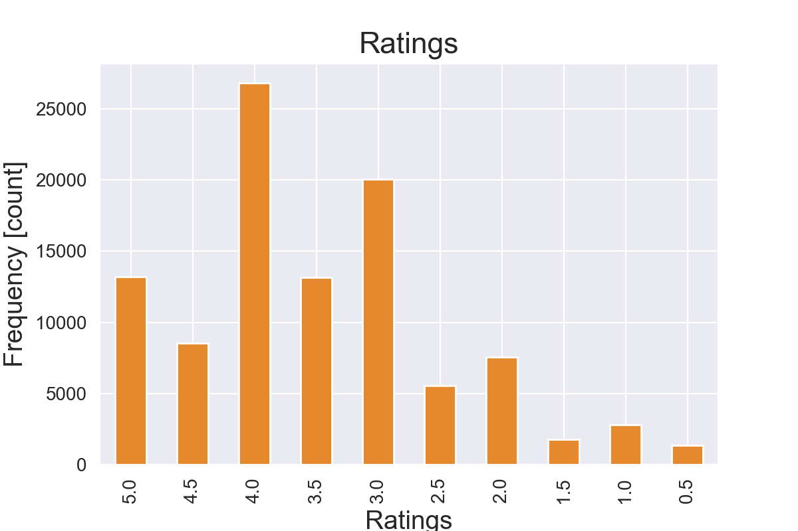
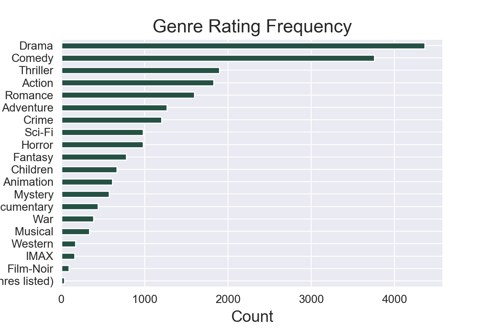

# Recommendation Systems with MovieLens Data

Jean-Paul Ventura and Yehuda Schein 

Data Science cohort 062220

## Introduction

The global video streaming market size was valued at USD 42.6 billion in 2019 and is projected to grow at a compound annual growth rate (CAGR) of 20.4% from 2020 to 2027 (https://www.grandviewresearch.com/industry-analysis/video-streaming-market).
Innovations in artificial intelligence and Machine Learning are expected to improve video quality and personalized recommendations and aid in market growth.

Recommendation systems AKA recommendation engines are information filtering tools that predict ratings for user-product interactions in big data environments (think netflix, spotify, google etc). The broad purpose of this computational technique is to provide users with personalized recommendations to other products and assist with product engagement while driving conversions. In addition to the latter, movie recommendation systems provide a mechanism to assist data professionals and stakeholders in classifying users with similar interests. This makes them an essential part of websites and e-commerce applications and the marketing of user base demographics. 

## The Data & Context.

In this exercise, we've used the MovieLens small-dataset curated by the Grouplens research lab at the University of Minnesota. The content consists of approximately 100,000 ratings of a corpus of 9,000 movies with 3600 tags submitted by a 600-person user base. The dataset is distributed over four csv files which contain information on ratings, movies, links and tags. For our purposes we've only considered the **ratings** and the **movies** datasets with some additional information obtained by tmdb api calls to select movie titles from tmdb-specific coded movie ids native to the curated dataset.

**Ratings**

The ratings dataset is comprised of 100,836 observations which are records of the user id(userId), the id of the movie that was rated by said user (movieId) and the time at which the rating was recorded (timestamp).

We can see that from the distribution of ratings in this data, the most common rating is a 4.0. This might indicate that most movies in this set are truthfully highly rated or possibly suggest user neutrality around this rating. The interpretation here may also have some effect as far as the a personalized recommendation.

 

We can see in the visualization above that the genres with most count of ratings are Drama, Comedy, Thriller and Action. This availability if it is generalized to the whole user dataset (this is only a subset of the data) my just pose a rating selection effect since most movies are rated in these categories.

**Hypothesis tests** were done for analyses of ratings vs budget and ratings vs runtime and for both tests and we concluded to

Rejected the null hypothesis that there is no statistically significant difference between the budget of a movie and its rating; the runtime of a movie and its rating.

**Movies**

The movies data table consists of tthe ID of the movies (movieId), the corresponding title (title) and genre of each movie (genres)

### Data Preprocessing & Structuring

The movielens dataset was curated and compiled before downloading. We removed extraneous columns in the primary data set (timestamp in the ratings table) as well as a host of extraneous variables retrieved from IMDB api calls.

## The Models

We chose to use two models to address two approaches in collaborative filtering recommendation engines. These models are KNN which is a Neigborhood-Based method of filtering (making automatic predictions) and SVD which is a model based method. 

**KNN:** 

KNN is a machine learning algorithm to find clusters of similar users (neighbors) based on common movie ratings, and make predictions using the average rating of top-k nearest neighbors. It uses the weighted-average of the k-most similar neighbors to issue a predicted rating.

**SVD:**

 SVD is another machine learning algorithm that tries to explain complex relationships between variables in a dataset by decomposing the dataset or matrix and centering on latent relationships much like PCA.
 It is found to be the most accurate approach to reduce problems with sparsity in the data as all users do not rate all movies leading to sparsity in the data. Another useful feature is that SVDs create embeddings (analogous to principle component loadings) which are low-dimensional hidden factors, which for a certain user and item coupling, can represent exogenous features of the data like how political a movie is, how much special effects it contained and perhaps how dialogue driven the movie is.
    
    
**Evaluation Metrics:**

   For our chosen models we primarily focused on RMSE as an evaluation metric since we want to evaluate how good our model predicts ratings a given user and movie. A lower RMSE is indicative of improved performance across model runs.

We focus on RMSE over MAE as our evaluation metric because RMSE penalizes larger errors more than MAE. They are both indifferent to the direction of errors and they are negatively oriented which means lower scores are better.

**KNN vs SVD:**

| KNN                                 | SVD                                                  |
|-------------------------------------|------------------------------------------------------|
| Complete input data is required     |Creates an abstract representation of the data (like PCs)|
| Does not scale well                 |Scales well|
| Pre-computation not possible        |pre-computation possible|
|Relies on user-itemsimilarity metrics|Relies on matrix factorization|

## Insights & Conclusions

Based on the low RMSE score and the high success rate from the empirical evaluation, we can say with high confidence that our preliminary model works well. Given an RMSE score of .86 we know that we can say that individual users with benefit from this personalized recommendation system. All the user needs to do is fill in ratings for a few movies from this data set and it will accurately return 5 movie recommendations.

We can market this technology to online streaming services who would benefit greatly from this low RMSE and high empirical evaluation.

In the future we will build onto this project and add better recommendations. One way we plan on doing this is only recommending movies based on certain genres if thats what the user wants to see. Another feature that we would like to add is a non-personalized recommendation system. We will list the top movies from years that the user chooses and only show the movies which they have not yet seen.
